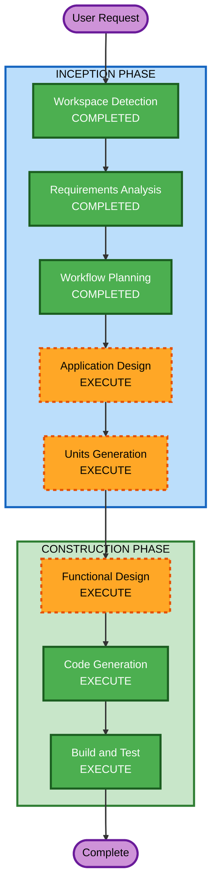

# Execution Plan

## Detailed Analysis Summary

### Change Impact Assessment
- **User-facing changes**: Yes - 고객용 주문 인터페이스 + 관리자 대시보드 신규 구축
- **Structural changes**: Yes - 전체 시스템 아키텍처 신규 설계 (프론트엔드 + 백엔드 + DB)
- **Data model changes**: Yes - 전체 데이터 모델 신규 설계 (Store, Table, Menu, Order 등)
- **API changes**: Yes - REST API 전체 신규 설계 + SSE 실시간 통신
- **NFR impact**: No - MVP 단계, 규모/성능 최적화 불필요

### Risk Assessment
- **Risk Level**: Medium (다수 컴포넌트, 실시간 통신 포함, 그러나 신규 프로젝트로 기존 시스템 영향 없음)
- **Rollback Complexity**: Easy (신규 프로젝트, 기존 시스템 없음)
- **Testing Complexity**: Moderate (API + SSE + 프론트엔드 통합 테스트 필요)

## Workflow Visualization



### Text Alternative
```
Phase 1: INCEPTION
- Workspace Detection (COMPLETED)
- Requirements Analysis (COMPLETED)
- Workflow Planning (COMPLETED)
- Application Design (EXECUTE)
- Units Generation (EXECUTE)

Phase 2: CONSTRUCTION
- Functional Design (EXECUTE, per-unit)
- Code Generation (EXECUTE, per-unit)
- Build and Test (EXECUTE)
```

## Phases to Execute

### INCEPTION PHASE
- [x] Workspace Detection (COMPLETED)
- [x] Requirements Analysis (COMPLETED)
- [ ] User Stories - SKIP
  - **Rationale**: 요구사항 문서에 사용자 시나리오가 충분히 명확하게 정의됨. 고객/관리자 두 역할이 명확하고 기능별 플로우가 상세히 기술됨.
- [x] Workflow Planning (IN PROGRESS)
- [ ] Application Design - EXECUTE
  - **Rationale**: 신규 프로젝트로 컴포넌트 구조, 서비스 레이어, 데이터 모델 설계 필요
- [ ] Units Generation - EXECUTE
  - **Rationale**: 다수의 기능 모듈(인증, 메뉴, 주문, 테이블, 실시간)이 있어 작업 단위 분해 필요

### CONSTRUCTION PHASE
- [ ] Functional Design - EXECUTE
  - **Rationale**: 데이터 모델, 비즈니스 로직(주문 생성, 세션 관리, SSE) 상세 설계 필요
- [ ] NFR Requirements - SKIP
  - **Rationale**: MVP 단계, 규모 고려 없음, 보안 확장 미적용
- [ ] NFR Design - SKIP
  - **Rationale**: NFR Requirements 미실행으로 불필요
- [ ] Infrastructure Design - SKIP
  - **Rationale**: 로컬 개발 환경만 구성, 인프라 설계 불필요
- [ ] Code Generation - EXECUTE (ALWAYS)
  - **Rationale**: 실제 코드 구현 필요
- [ ] Build and Test - EXECUTE (ALWAYS)
  - **Rationale**: 빌드 및 테스트 지침 필요

### OPERATIONS PHASE
- [ ] Operations - PLACEHOLDER
  - **Rationale**: 향후 배포/모니터링 워크플로우

## Estimated Timeline
- **Total Stages to Execute**: 5 (Application Design, Units Generation, Functional Design, Code Generation, Build and Test)
- **Total Stages to Skip**: 5 (Reverse Engineering, User Stories, NFR Requirements, NFR Design, Infrastructure Design)

## Success Criteria
- **Primary Goal**: 테이블오더 MVP 시스템 구축 (고객 주문 + 관리자 모니터링)
- **Key Deliverables**:
  - Vue.js 프론트엔드 (고객용 + 관리자용)
  - Express.js REST API 서버
  - SQLite 데이터베이스
  - SSE 기반 실시간 주문 알림
- **Quality Gates**:
  - API 엔드포인트 정상 동작
  - 프론트엔드-백엔드 통합 동작
  - 주문 생성 → 실시간 알림 플로우 동작
